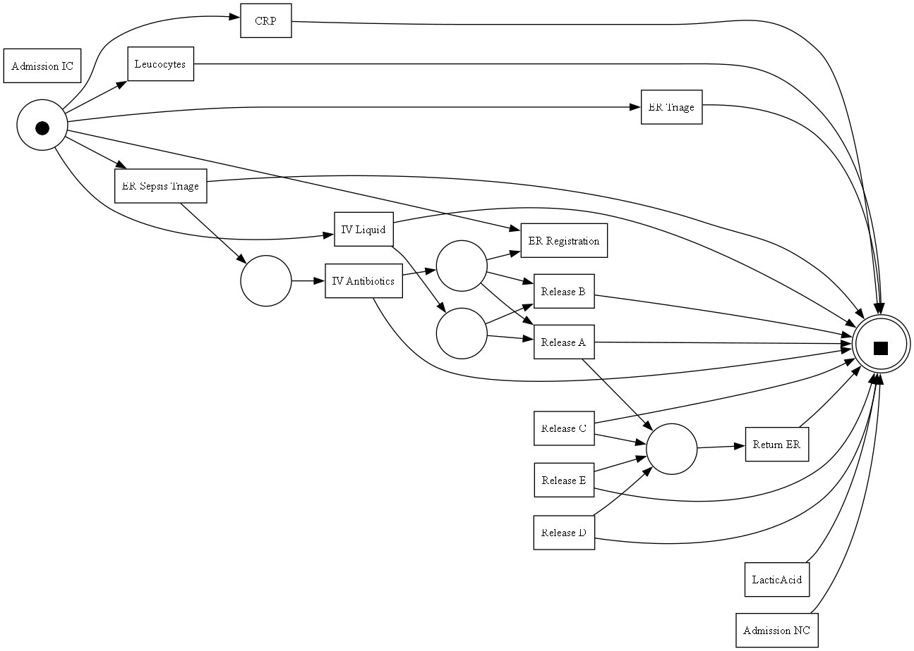
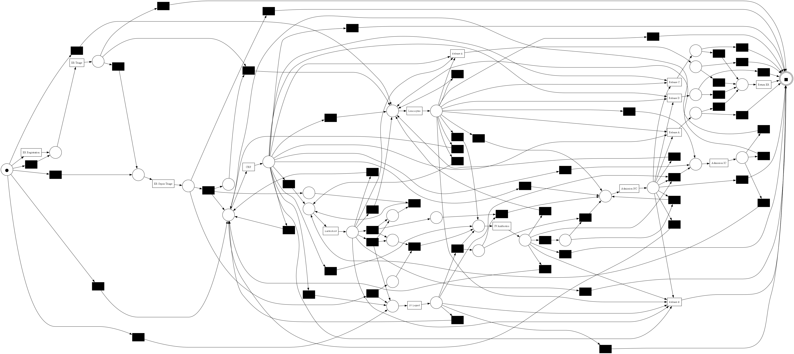

# ST1056-Process-Mining

This project applies **process mining techniques** to a real-life hospital event log of sepsis cases, using the [PM4Py](https://pm4py.fit.fraunhofer.de/) Python library.

It loads a `.xes` log, performs basic analysis, applies two **process discovery** algorithms (Alpha Miner and Heuristics Miner), runs **conformance checking** (Token-based and Alignment-based), and computes evaluation metrics: **Fitness**, **Precision**, **Generalization**, and **Simplicity**.

The goal is to analyze the performance of the two discovery algorithms (Alpha Miner and Heuristics Miner), applied to the same log.

## Sepsis Cases Event Log

**Author**: Felix Mannhardt, Eindhoven University of Technology  
**Event log**: [10.4121/uuid:915d2bfb-7e84-49ad-a286-dc35f063a460](https://doi.org/10.4121/uuid:915d2bfb-7e84-49ad-a286-dc35f063a460)

This real-world event log contains hospital cases related to **sepsis**, a life-threatening condition often caused by infection.  
Each case traces a patient's journey through the hospital, recorded by the hospital's ERP system.

- ~1,000 **cases** (traces)
- ~15,000 **events**
- 16 **distinct activities**
- 39 **clinical data attributes** (e.g., checkboxes for symptoms, lab test results, etc.)

**Timestamps are anonymized**, but the relative timing between events within each trace is preserved.

## Requirements

- Python ≥ 3.8

### Python libraries
- [pm4py](https://pypi.org/project/pm4py/): a library designed for process mining, which involves analyzing and visualizing business processes based on event log data. It supports tasks such as process discovery, conformance checking, and performance analysis.
- [tabulate](https://pypi.org/project/tabulate/): provides a simple function to print tabular data in various human-readable formats. Useful for displaying structured data in the console.
- [termcolor](https://pypi.org/project/termcolor/): a library for adding color to terminal output. Supports basic colors and styles like bold and underline.

To install python libraries:
```bash
pip install -r requirements.txt
```

or:
```bash
pip install pm4py tabulate termcolor
```

## Other
- [Graphiviz](https://graphviz.org/): is an open-source graph visualization software developed by AT&T Labs Research. It provides a collection of tools and libraries for rendering structured data as diagrams of abstract graphs and networks ([Installation guide](https://graphviz.org/download/)).

## Project Structure

```bash
.
├── pm.py                    # Main script
├── libs/
│   └── log_analyzer.py      # Log analysis functions
├── logs/
│   └── log.xes              # Input event log
├── results/
│   ├── alpha_net.png        # Alpha Miner process model
│   └── heuristics_net.png   # Heuristics Miner process model
├── requirements.txt
└── README.md
```

## Run the project

Execute the main script:

```bash
python pm.py
```

This will:

- Print descriptive statistics about the log

- Discover process models using Alpha Miner and Heuristics Miner

- Perform token-based and alignment-based conformance checking

- Compute model quality metrics

Model visualizations (Petri Nets) are saved as:

- `results/alpha_net.png`
- `results/heuristics_net.png`

## Results

### Log analysis

```bash
=========== Basic Statistics ===========
+-----------------------------+-------+
| Number of cases (traces)    |  1050 |
+-----------------------------+-------+
| Total number of events      | 15214 |
+-----------------------------+-------+
| Number of unique activities |    16 |
+-----------------------------+-------+


Activities (16):
+------------------+
| Activity         |
+==================+
| Admission IC     |
+------------------+
| Admission NC     |
+------------------+
| CRP              |
+------------------+
| ER Registration  |
+------------------+
| ER Sepsis Triage |
+------------------+
| ER Triage        |
+------------------+
| IV Antibiotics   |
+------------------+
| IV Liquid        |
+------------------+
| LacticAcid       |
+------------------+
| Leucocytes       |
+------------------+
| Release A        |
+------------------+
| Release B        |
+------------------+
| Release C        |
+------------------+
| Release D        |
+------------------+
| Release E        |
+------------------+
| Return ER        |
+------------------+

Number of variants: 846
Top 5 variants:
+------------------------------------------------------------------------------------------------------------------------+-------------------+
| Variant (Activity Sequence)                                                                                            |   Number of Cases |
+========================================================================================================================+===================+
| ('ER Registration', 'ER Triage', 'ER Sepsis Triage')                                                                   |                35 |
+------------------------------------------------------------------------------------------------------------------------+-------------------+
| ('ER Registration', 'ER Triage', 'ER Sepsis Triage', 'Leucocytes', 'CRP')                                              |                24 |
+------------------------------------------------------------------------------------------------------------------------+-------------------+
| ('ER Registration', 'ER Triage', 'ER Sepsis Triage', 'CRP', 'Leucocytes')                                              |                22 |
+------------------------------------------------------------------------------------------------------------------------+-------------------+
| ('ER Registration', 'ER Triage', 'ER Sepsis Triage', 'CRP', 'LacticAcid', 'Leucocytes', 'IV Liquid', 'IV Antibiotics') |                13 |
+------------------------------------------------------------------------------------------------------------------------+-------------------+
| ('ER Registration', 'ER Triage', 'ER Sepsis Triage', 'Leucocytes', 'CRP', 'LacticAcid')                                |                11 |
+------------------------------------------------------------------------------------------------------------------------+-------------------+

======= Case Duration Statistics =======
+----------------------------+-----------+
| Average duration (minutes) |  40995.8  |
+----------------------------+-----------+
| Minimum duration (minutes) |      2.03 |
+----------------------------+-----------+
| Maximum duration (minutes) | 608146    |
+----------------------------+-----------+
```

### Petri Nets


*Alpha Miner Model*


*Heuristics Miner Model*

### Model Evaluation
```bash
+-----------------+-------------------------+------------------------+-------------+------------------+--------------+
| Algorithm       |   Fitness (Token-based) |   Fitness (Alignments) |   Precision |   Generalization |   Simplicity |
+=================+=========================+========================+=============+==================+==============+
| Alpha Miner     |                  0.2659 |                 0.1363 |      0.4426 |           0.9132 |       0.4783 |
+-----------------+-------------------------+------------------------+-------------+------------------+--------------+
| Heuristic Miner |                  0.8968 |                 0.6503 |      0.7024 |           0.8415 |       0.4332 |
+-----------------+-------------------------+------------------------+-------------+------------------+--------------+
```